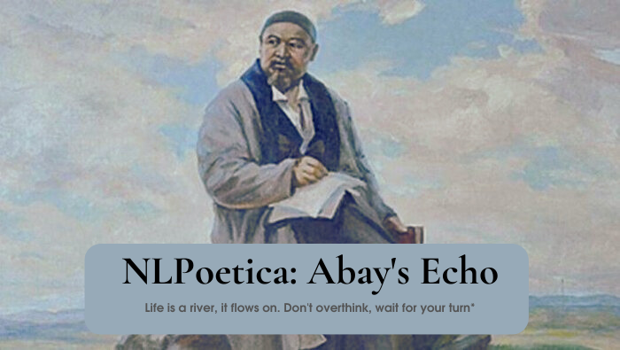

# NLPoetica: Abay's Echo

Welcome to NLPoetica: Abay's Echo! This repository is dedicated to the creation of new poems inspired by the timeless works of the renowned Kazakh writer, Abay Qunanbayev. 

## About
**Abay Qunanbayev**, a prominent figure in Kazakh literature, has left a lasting legacy with his profound and emotive poetry. This project seeks to pay homage to his literary contributions by employing natural language processing techniques to generate new poems in his distinctive style.

## Dataset
The `dataset` folder within this repository contains a comprehensive collection of Abay's poems, meticulously curated and compiled into a single cohesive dataset. This dataset serves as the foundation for training the various models implemented in this project.

## Models
In this repository, you will find implementations of several character-based models trained on Abay's poetry dataset:

- **Recurrent Neural Network (RNN):** A deep learning model designed to capture the sequential nature of poetry and generate coherent verses.
- **Bigram Model:** A probabilistic model that leverages the statistical relationships between consecutive pairs of characters in the text to generate poetic sequences.
- **Multi-Layer Perceptron (MLP):** A neural network architecture capable of learning intricate patterns within the text data and generating poetic compositions.

